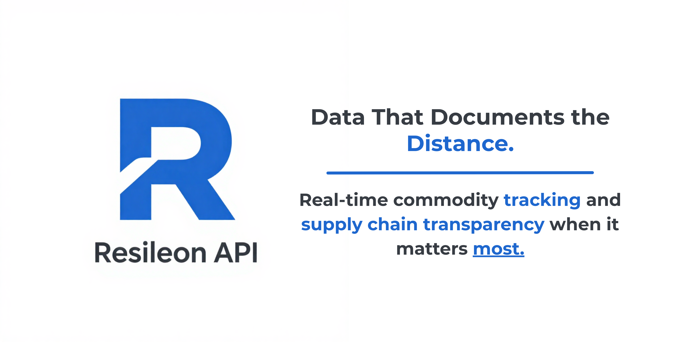

<p align="center">
  
</p>

<p align="center">
  <a href="#endpoints">Endpoints</a> &nbsp;·&nbsp;
  <a href="#conflict-zones">Zones</a> &nbsp;·&nbsp;
  <a href="#pricing">Pricing</a> &nbsp;·&nbsp;
  <a href="#data-safety">Safety Policy</a>
</p>

---

Resileon surfaces economic data from conflict-affected regions. It tracks commodity futures from global exchanges and monitors public humanitarian feeds for supply-chain disruptions, serving both through a clean JSON API.

**Commodities tracked:** Wheat · Crude Oil · Natural Gas · Corn · Diesel  
**Logistics signals:** Port closures · Border blockages · Road disruptions · Airspace status  
**Regions:** Eastern Europe · Middle East · Sub-Saharan Africa

**Get access:** [RapidAPI](https://rapidapi.com/resileon/api/resileon-api)

---

## Endpoints

| Method | Path | Returns |
|--------|------|---------|
| `GET` | [`/v1/status`](#get-v1status) | Server health and last scrape timestamp |
| `GET` | [`/v1/markets`](#get-v1markets) | All active conflict zones |
| `GET` | [`/v1/commodities/{zone_id}`](#get-v1commoditieszone_id) | Commodity prices with 24h and 7d change |
| `GET` | [`/v1/logistics`](#get-v1logistics) | Port, border, airport, and road status |

**Base URL:** `https://api.resileon.io/v1`  
**Interactive docs:** `https://api.resileon.io/docs`

---

## GET /v1/status

```json
{
  "status": "healthy",
  "version": "1.0.0",
  "last_scrape": "2026-03-09T12:00:00Z",
  "zones_tracked": 8,
  "data_delay_note": "All data is delayed by a minimum of 1 hour.",
  "timestamp": "2026-03-09T13:05:00Z"
}
```

---

## GET /v1/markets

Returns all active zones. Use an `id` value to query `/v1/commodities/{zone_id}`.

```json
{
  "zones": [
    {
      "id": "ua-kherson",
      "name": "Kherson Oblast",
      "country": "Ukraine",
      "region": "Eastern Europe",
      "conflict_level": "active",
      "latitude": 46.6354,
      "longitude": 32.6168,
      "is_active": true,
      "updated_at": "2026-03-09T12:00:00Z"
    }
  ],
  "total": 8,
  "timestamp": "2026-03-09T13:05:00Z"
}
```

---

## GET /v1/commodities/{zone_id}

Commodity prices for a specific zone with 24h and 7-day percentage change.

**Parameters**

| Name | In | Required | Description |
|------|----|----------|-------------|
| `zone_id` | path | yes | Zone ID from `/v1/markets` |
| `category` | query | no | Filter by `food`, `energy`, or `medical` |

```bash
GET /v1/commodities/sy-aleppo?category=food
```

```json
{
  "zone_id": "sy-aleppo",
  "zone_name": "Aleppo Region",
  "commodities": [
    {
      "id": 1,
      "name": "Wheat",
      "category": "food",
      "unit": "metric_ton",
      "currency": "USD",
      "current_price": 622.00,
      "price_24h_ago": 618.50,
      "price_change_24h": 0.57,
      "price_change_7d": -1.12,
      "source": "CBOT Wheat Futures (Yahoo Finance)",
      "published_at": "2026-03-09T12:00:00Z"
    }
  ],
  "total": 3,
  "timestamp": "2026-03-09T13:05:00Z"
}
```

**Errors**

| Code | Error | Cause |
|------|-------|-------|
| `404` | `zone_not_found` | `zone_id` not recognised. Check `/v1/markets` for valid IDs. |
| `429` | `rate_limit_exceeded` | Daily request limit reached. |

---

## GET /v1/logistics

Port, border crossing, airport, and road status derived from live news signals.

**Parameters**

| Name | In | Required | Description |
|------|----|----------|-------------|
| `zone_id` | query | no | Filter by zone |
| `status` | query | no | `open`, `restricted`, `closed`, or `unknown` |
| `hub_type` | query | no | `port`, `border`, `airport`, or `road` |

```json
{
  "updates": [
    {
      "id": 1,
      "zone_id": "ua-kherson",
      "hub_name": "Port of Odessa",
      "hub_type": "port",
      "status": "restricted",
      "severity": "high",
      "description": "Partial closure. Grain shipments operating at 40% capacity.",
      "source": "Reuters",
      "published_at": "2026-03-09T12:00:00Z"
    }
  ],
  "total": 12,
  "timestamp": "2026-03-09T13:05:00Z"
}
```

---

## Error reference

```json
{
  "error": "rate_limit_exceeded",
  "message": "You have exceeded the allowed request rate for this endpoint.",
  "detail": "Limit: 50/month",
  "upgrade_url": "https://rapidapi.com/resileon/api/resileon-api"
}
```

| Code | Meaning |
|------|---------|
| `404` | Zone not found, or endpoint does not exist |
| `429` | Rate limit hit. Check the `Retry-After` response header. |
| `500` | Server error. Contact dxveworkcode@gmail.com |

---

## Data safety

All data carries a mandatory one-hour publication delay. Records expose two timestamps:

- **`data_timestamp`** — when the price or signal was collected from its source
- **`published_at`** — when it became visible via the API (always at least 1 hour later)

This constraint is enforced at the application level and cannot be bypassed through any configuration.

---

## Pricing

Access via [RapidAPI](https://rapidapi.com/resileon/api/resileon-api).

| Tier | Requests/month | Price |
|------|----------------|-------|
| Basic | 50 | Free |
| Pro | 2,500 | $25/month |
| Ultra | 10,000 | $75/month |

---

## Conflict zones

| Zone ID | Name | Country | Region |
|---------|------|---------|--------|
| `ua-kherson` | Kherson Oblast | Ukraine | Eastern Europe |
| `ua-zaporizhzhia` | Zaporizhzhia Oblast | Ukraine | Eastern Europe |
| `sy-aleppo` | Aleppo Region | Syria | Middle East |
| `sy-idlib` | Idlib Governorate | Syria | Middle East |
| `ye-aden` | Aden Governorate | Yemen | Middle East |
| `sd-darfur` | Darfur Region | Sudan | Sub-Saharan Africa |
| `so-mogadishu` | Mogadishu Region | Somalia | Sub-Saharan Africa |
| `et-tigray` | Tigray Region | Ethiopia | Sub-Saharan Africa |

---

&copy; 2026 Resileon. All rights reserved.
